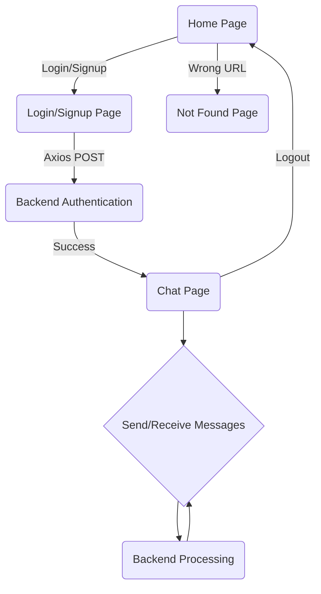

# React + TypeScript + Vite

This template provides a minimal setup to get React working in Vite with HMR and some ESLint rules.

Currently, two official plugins are available:

- [@vitejs/plugin-react](https://github.com/vitejs/vite-plugin-react/blob/main/packages/plugin-react/README.md) uses [Babel](https://babeljs.io/) for Fast Refresh
- [@vitejs/plugin-react-swc](https://github.com/vitejs/vite-plugin-react-swc) uses [SWC](https://swc.rs/) for Fast Refresh

## Expanding the ESLint configuration

If you are developing a production application, we recommend updating the configuration to enable type aware lint rules:

- Configure the top-level `parserOptions` property like this:

```js
   parserOptions: {
    ecmaVersion: 'latest',
    sourceType: 'module',
    project: ['./tsconfig.json', './tsconfig.node.json'],
    tsconfigRootDir: __dirname,
   },
```

- Replace `plugin:@typescript-eslint/recommended` to `plugin:@typescript-eslint/recommended-type-checked` or `plugin:@typescript-eslint/strict-type-checked`
- Optionally add `plugin:@typescript-eslint/stylistic-type-checked`
- Install [eslint-plugin-react](https://github.com/jsx-eslint/eslint-plugin-react) and add `plugin:react/recommended` & `plugin:react/jsx-runtime` to the `extends` list

- Of course! Here's your full, **professionally merged and refined** document, including **all** parts you mentioned (with stylish emojis, icons, proper organization, and now also including the **"How to Describe the Project in an Interview"** section at the end):

---

# 🚀 **Frontend Overview**

✨ Your project is a **Full-Stack Web Application** leveraging **React.js**, **Material-UI**, and **Axios** for a seamless, modern user experience.  
It features **user authentication**, **chat functionality**, and **dynamic routing** within a **sleek, minimalist UI** design.  

---

# 🧩 **Key Components & Pages**

## ⚡ App Component (`App.tsx`)
- **Root** of the application.
- Integrates **Header** and sets up **Routing** using React Router.
- **Conditional Routing**:  
  - Logged-in users 👉 Access `/chat`.
  - Guests 👉 Stay on `/login` or `/signup`.

**Routes:**
- `/` → Home Page 🏡  
- `/login` → Login Page 🔐  
- `/signup` → Signup Page 📝  
- `/chat` → Chat Page 💬 (Authenticated only)
- `*` → Not Found Page 🚫

---

## 🛠️ Helper Functions (`helpers.ts`)
Manage **HTTP interactions** with the backend via **Axios**:

- 🔐 `loginUser`: Authenticate existing user.
- 📝 `signupUser`: Register new user.
- 🔍 `checkAuthStatus`: Validate user session.
- ✉️ `sendChatRequest`: Send a chat message.
- 🗂️ `getUserChats`: Fetch all chat history.
- 🗑️ `deleteUserChats`: Delete all user chats.
- 🚪 `logoutUser`: Log out user.

---

# 🎨 **Styling & Animation (`index.css`)**

- **Logo Spin Animation** 🔄: Adds dynamic visual.
- **Hover Effects** ✨: Interactive logo glow.
- **Custom Fonts**: *Roboto Slab* & *Work Sans* from Google Fonts.
- **Responsive Design** 📱: Supports various screen sizes.

---

# 🎨 **Material-UI Integration**

- **Theming** 🎨: Customized using `createTheme`, emphasizing white text on dark backgrounds.
- **Form Elements** 🧾: Beautiful, accessible inputs (e.g., `OutlinedInput`).

---

# 📜 **Step-by-Step Workflow**

## 🏠 1. **Home Page (`Home.tsx`)**
- Minimalist welcome screen.
- Buttons for **Login** 🔐 and **Sign Up** 📝.

---

## 🔑 2. **Authentication Flow**

### ✨ 2.1 **Login Process (`/login`)**
- User submits email and password.
- Axios `POST` → Backend `/user/login`.
- On success ➡️ Token/session saved ➡️ Redirect to **/chat**.
- On failure ➡️ Display error 🚨.

---

### ✨ 2.2 **Signup Process (`/signup`)**
- User provides name, email, password.
- Axios `POST` → Backend `/user/signup`.
- Success ➡️ Redirect to **/login**.
- Error ➡️ Inform user.

---

## 💬 3. **Chat System (`/chat`)**

- **Retrieve Chats** 📜: Axios `GET` → `/chat/all-chats`.
- **Send Message** ✉️: Axios `POST` → `/chat/new`.
- **Delete Chats** 🗑️: Axios `DELETE` → `/chat/delete`.
- **Logout** 🚪: Axios `GET` → `/user/logout`.

> 💡 **Future Upgrade Tip:**  
> Consider upgrading to **WebSocket** for **real-time messaging** 🚀.

---

# 🛡️ **Routing and Protected Routes**

- `/chat` page is **protected** — available only to logged-in users.
- **React Router + AuthContext** manage user redirections securely.

---

# 🧩 **Tech Stack Overview**

| Tech | Purpose |
|:----:|:--------|
|  **React.js** | UI Framework |
|  **Material-UI** | UI Styling |
|  **Axios** | HTTP Requests |
|  **CSS3** | Custom Styling & Animations |
|  **React Router** | Routing & Navigation |
|  **React Context API** | Authentication State Management |

> **Backend Presumption:**  
> - Node.js + Express.js 🌐  
> - MongoDB 🛢️  
> - JWT Authentication 🔐

---

# 🚀 **Possible Future Improvements**

- 🌐 **Real-time Chat**: Integrate **WebSockets** for instant messaging.
- 📈 **Advanced State Management**: Migrate to **Redux** or **Recoil** for larger scale apps.
- 🚨 **Error Feedback**: Add **toasts/modals** instead of basic alerts.
- 🧑‍💻 **User Profiles**: Allow updating profile pictures, display names, etc.

---

# 🎯 **Conclusion**

This frontend setup is a **well-architected** React application with:
- Clean UI & UX,
- Secure authentication,
- Structured routing,
- Scalable code practices.  

With minor improvements like **real-time messaging**, this application could transform into a fully professional real-time communication platform! 🚀

---

# 📊 **Summary: Project Flow**



---

# 🎤 **6. How to Describe the Project in an Interview**

When describing this project during an interview, explain it **clearly, logically, and step-by-step**:

## 1. **Introduction**
- Start by defining the problem: creating a simple yet efficient chat system with secure user authentication.
- Mention the tech stack: **React.js** frontend, **Node.js/Express** backend.

## 2. **Frontend Explanation**
- Describe key components: **Home**, **Login**, **Signup**, **Chat**, and **Not Found**.
- Explain communication: frontend uses **Axios** for API interactions (login, signup, chatting).
- Mention **AuthContext**: manages authentication state and protected routes (`/chat`).

## 3. **Backend Explanation**
- Highlight API endpoints for **signup**, **login**, **chat**, and **session management**.
- Discuss authentication using **JWT** and storage of users/chats in **MongoDB**.

## 4. **User Flow**
- Flow: **Signup → Login → Chatting → Logout**.
- Emphasize smooth communication using **Axios** throughout.

## 5. **Future Enhancements**
- Suggest using **WebSockets** for real-time messaging 📡.
- Adding user profiles, notifications, and improving UI/UX further.

## 6. **Technologies Used**
- **Frontend:** React.js, Material-UI, Axios.
- **Backend:** Node.js, Express.js.
- **Database:** MongoDB.
- **Authentication:** JWTs.
- Reason: Lightweight, scalable, popular in modern web development.

> 🔥 **Tip:** While speaking, show passion for how you handled authentication, protected routes, and thought about real-time chat improvements — this shows your growth mindset!

---

